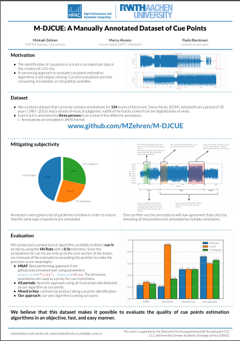
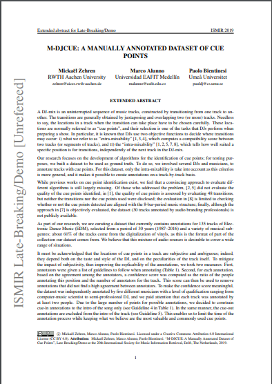

# M-DJCUE
A manually annotated dataset of cue points

## Introduction

As part of our research, we are curating a dataset that currently contains annotations for 134 tracks of Electronic Dance Music (EDM), selected from a period of 30 years (1987–2016) and a variety of musical subgenres; about 60% of the tracks come from the digitalization of vinyls.

We believe that this dataset makes it possible to evaluate the quality of cue points estimation algorithms in an objective, fast, and easy manner.

See our poster and abstract from IMSIR 2019:

    
    

## The annotations

All the annotations are in <a href="https://github.com/marl/jams">JAMS format</a>. Each file consists of annotations grouped by annotator containing the fields described in the namespace <a href="scripts/cue_point.json">scripts/cue_point.json</a>:
* time: position in seconds 
* value:
    * label: either "IN" or "OUT" to specify if it is a cue in or a cue out
    * comment: comment of the annotator for this specific position. (The comments will always start with either "in" or "out" as a way to ease the annotation process.)
* duration (optional): Used for the cue outs only. Indicates a segment with a duration limiting where the fade-out can occur.

## Quality of the annotations

It must be acknowledged that the locations of cue points in a track are subjective and ambiguous; indeed, they depend both on the taste and style of the DJ, and on the peculiarities of the track itself. To mitigate the impact of 
subjectivity, thus improving the replicability of the annotations, we took two measures: First, annotators were given a list of guidelines to follow when annotating. Second, an agreement score can be computed for each position annotated.

### Guidelines for the annotators

1. Mark the exact position in the track when you would switch tracks during a DJ-mix: This means that
either this track or an upcoming track become prevalent in a cross-fade. The former is a cue in point, and
the latter is a cue out.
2. Annotations coincide with positions of high novelty that do not interrupt strong musical elements (e.g., a
bass or voice line). They are located at the start of a bar and are precise at 1/10th of a second.
3. Cue ins are found where a track is considered to be able to stand on its own in the mix (when the musical
content following this position is judged interesting and not too quiet to be played alone).
4. Cue ins are found within the intro section of the track up to, but not exceeding the first beat of the core
section (also called the main part or chorus).
5. cue outs are found anywhere within the track, but not before the core section.
6. cue outs can have a duration if a fade-out lasting up to the next major events in the outgoing track follows
(e.g., a cue out during a breakdown which precedes a chorus).

Due to the large number of points for possible annotations, we decided to constrain cue in annotations to the intro of the song only (see guideline 4). In the same manner, the cue out annotations are excluded from the intro of the track (see guideline 5). This enables us to limit the time of the annotation process while keeping what we believe are the most valuable and commonly used cue points. We argue that this limitation could, and should be addressed
when using this dataset for an evaluation by artificially limiting the assessment to the portions of the track
covered by the annotations.

### Agreement between the annotators

For each annotation, based on the agreement among the annotators, a score can be computed as the ratio of the people annotating this position and the number of annotators for the track. We believe that this score can then be used to remove annotations that did not find a high agreement between annotators. To make the score meaningful, the dataset was independently annotated by five different musicians with a level of qualification ranging from computer-music scientist to semi-professional DJ, and we paid attention that each track was annotated by three people. The score is not explicitly computed in this dataset to not enforce a specific implementation. We recommend using a tolerance window of 0.5s to merge annotations from multiple annotators. 

## Metadata

Because the tracks annotated are copyrighted, the audio content cannot be distributed. However, we provide some metadata:

* title: title of the track or remix 
* artist: name of the artist(s)
* release: release year of the track
* duration: duration of the track
* identifiers:
  * isVinyl: if the original audio comes from vinyl digitalization
  * mirrors: list of alternative sources for the audio (when available)
    * type: service providing the audio (only Youtube at the moment)
    * url: url to the audio
    * offset: how much you should move the alternative audio to match with the original
    * playbackSpeed: how fast you should you play the alternative audio to match with the original

Note: to convert the annotation times to the alternative audio's space, apply the formula: 
talternative = toriginal * playbackSpeed - offset

TODO: Create loader in <a href="https://github.com/mir-dataset-loaders/mirdata">mirdata</a>.

